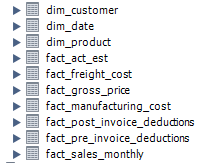

# SQL - Power BI Sales Dashboard
## Introduction 
In this project, I have created a dynamic sales dashboard designed to provide you with a comprehensive view of your sales performance through Key Performance Indicators (KPIs), while also giving you the power to delve deeper into your product and customer data.
## Problem Statement 
We have all the sales data in 7 different fact tables and 3 dimension tables.

